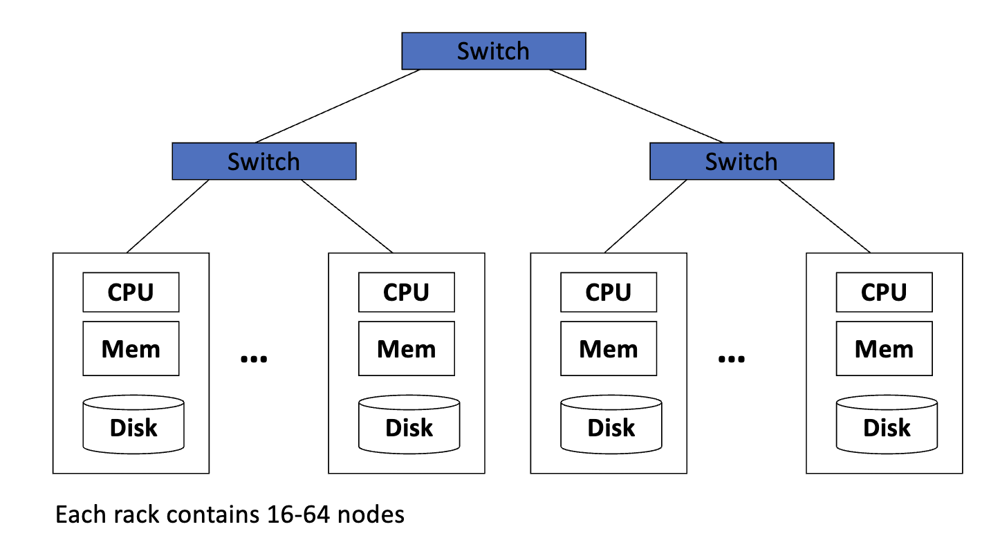
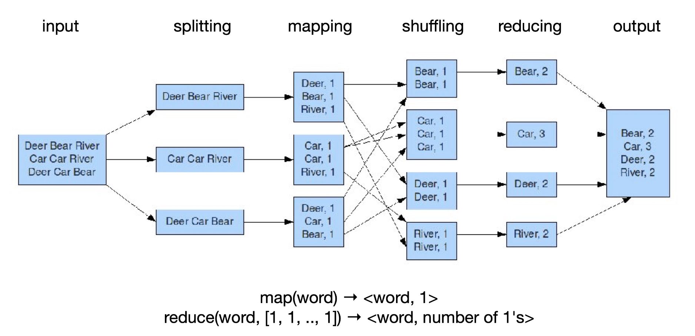

# MapReduce

**Cluster Computing Architecture**

## MapReduce

**Intuition**
- **Split**: Partition data into chunks and distribute to different machiens
- **Map**: Map data items to a list of <key, value> pairs
- **Shuffle**: Group data with the same key and send to the same machine
- **Reduce**: Takes a list of values with the same key <key, $[\text{value}_1, \dots, \text{value}_k]$> and outputs list of new data items

**Formally**
- **Input**: A set of key-value pairs $<k,v>$
- **map**$(k,v)\to<k_1,v_1>, <k_2, v_2>, \dots, <k_n,v_n>$
- **reduce**$(k, [v_1,v_2,\dots,v_r])\to<k,v_1'>, \dots, <k,v_s'>$

>[!example]+ MapReduce: Word counting
>**Input**: Document of words
>**Output**: Frequency of each words
>- Document: "Deer Bear River Car Car River Deer Car Bear"
>- (Bear, 2), (Car, 3), (Deer, 2), (River, 2)
>
>

>[!example]+ MapReduce: Inverted index
>**Input:** Set of documents
>**Output:** List of documents that contain each word
>
>- **map**(word in document $i$) $\to$ <word, $i>$
>- **reduce**(word, $[i_1,i_2, \dots, i_k]$)$\to$<word, $\underbrace{ [j_1,j_2,\dots,j_k] }_{ \text{Unique (sorted)} }$>

>[!example]+ Matrix vector multiplication
>**Input**: $r\times n$ matrix $M$, vector $v$ of length $n$
>**Output**: vector $v=Mv$ of length $r$ with entries $x_i=\sum_{j=1}^{n} m_{ij}v_j \,$
>
>map($m_{ij}$)$\to<i,m_{ij}v_j>$
>reduce: simply sum up all values associated to a key $i$ to get $<i,x_i>$

## Relation operations with MapReduce
A relation is a table with column headers called *attributes*.

- Rows of the table are called *tuples*
- Write $R(A_1,A_2,\dots,A_n)$ to say that the relation name is $R$ and its attributes are $A_1,A_2,\dots,A_n$
- Used in databases

### Operations
- **Selection**: with applied condition $C, denoted $\sigma_C(R)$.
	- **map**: For each tuple $t$ in relation $R$ test if it satisfies $C$. If it does produce $<t,t>$ otherwise `None
	- **reduce**: Identity function
	
- **Projection**: For a subset $S\subset A$ produce for each tuple only the components for the attributes in $S$. $\pi_S(R)$.
	- **map**: For each tuple $t$ in $R$ construct a tuple $t'$ by eliminating from $t$ those components whose attributes are not in $S$. Output $<t',t'>$.
	- **reduce**: $<t',[t',t',\dots,t']>\to<t',t'>$
	
- **Union**: $R \cup S$
	- **map**: $<t,t>$
	- **reduce**: $<t,[t]>\to<t,t>$ and $<t,[t,t]>\to<t,t>$
	
- **Intersection**: $R\cap S$
	- **map**: $<t,t>$
	- **reduce**: $<t,[t,t]>\to<t,t>$ and $<t,[t]>\to$`None`
	
- **Difference**: $R-S$
	- **map**: $t\to<t,R>$ for $t \in R$ and $t\to<t,S>$ for $t \in S$
	- **reduce**: produce $<t,t>$ if value list is $[R]$, otherwise `None`
	
- **Natural join**: $R(A,B) \bowtie S(B,C)$
	- **map**:
		- $(a,b)\to<b,(R,a)>$ for $(a,b)\in R$
		- $(b,c)\to <b,(S,c)>$ for $(b,c)\in S$
	- **reduce**: Construct all triples $(a,b,c)$ where $(R,a)$ and $(S,c)$ are associated to key $b$. These triplets are the values and keys are irrelevant
	
- **Grouping and aggregation**: For a subset $G \subset A$ partition tuples in $R$ according to their values for attributes $G$. Aggregate other columns $Z$ according to $SUM, COUNT, AVG, MIN, MAX, \dots$. Results in one tuple per group.
	- For $R(A,B,C)$, $G=\left\{ A \right\}$, $Z=\left\{ B \right\}$, and aggregation function $\theta$.
	- **map**: $(a,b,c)\to<a,b>$
	- **reduce**: $(a,[b_1,\dots,b_k])\to(a,\theta([b_1,\dots,b_k]))$

